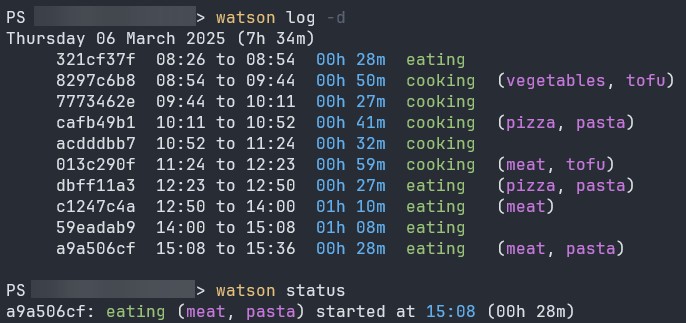

### Requirements

- [.NET 8.0 or higher](https://dotnet.microsoft.com/en-us/download/dotnet/8.0)

### Installation

#### Using dotnet (easiest)

```
dotnet tool install --global nomis51.watson
```

#### Standalone

- Go to the [Release page](https://github.com/nomis51/watson/releases/latest)
- Download the latest zip file for your platform
- Extract
- Run `Watson.exe`

## Usage

When you want to track a task or an activity, you create a new `frame` with the following command :

```
watson start cooking pizza
```

Each `frame` need a `project`.
You can also add as many `tags` as you want to describe the `frame`.
In the example above, we have the project `cooking` with the tag `pizza`.
So we're basically "cooking a pizza" in that frame.

When you're ready for another task or activity, you can `start` another `frame`.
You can also `stop` the current `frame` at any time.

You can display the `status` of the current `frame` with the `status` command.

And you can also list of all the `frames` within a time period with the `log` command.



For more details about all the available commands and options run `watson help` or visit
the [commands page](commands.md).
